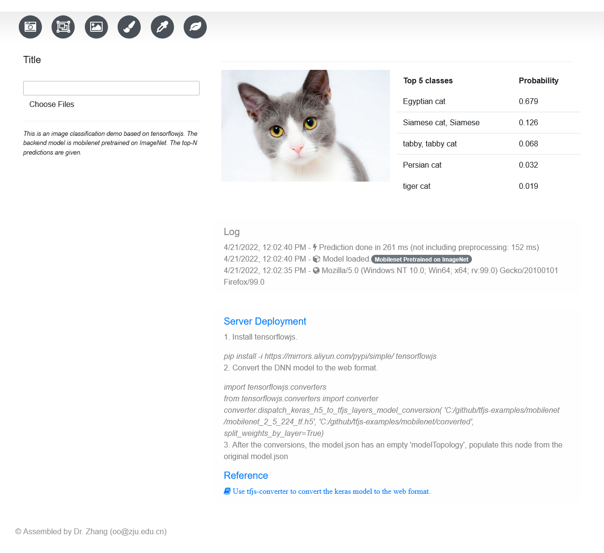
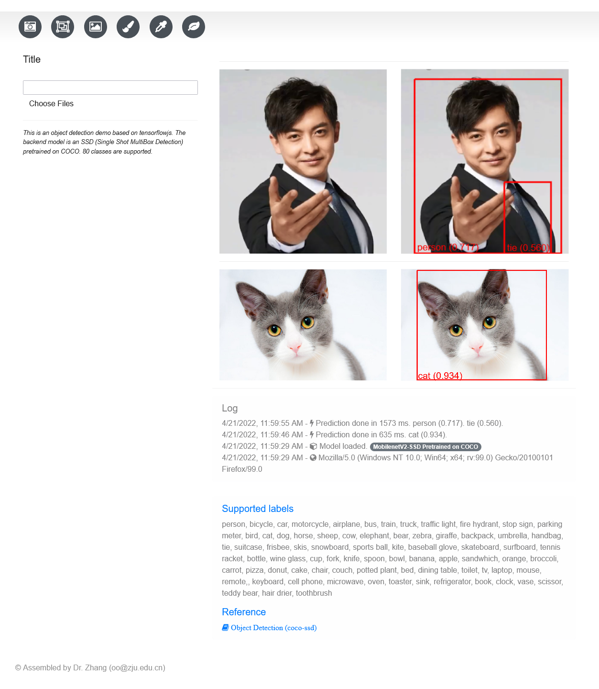
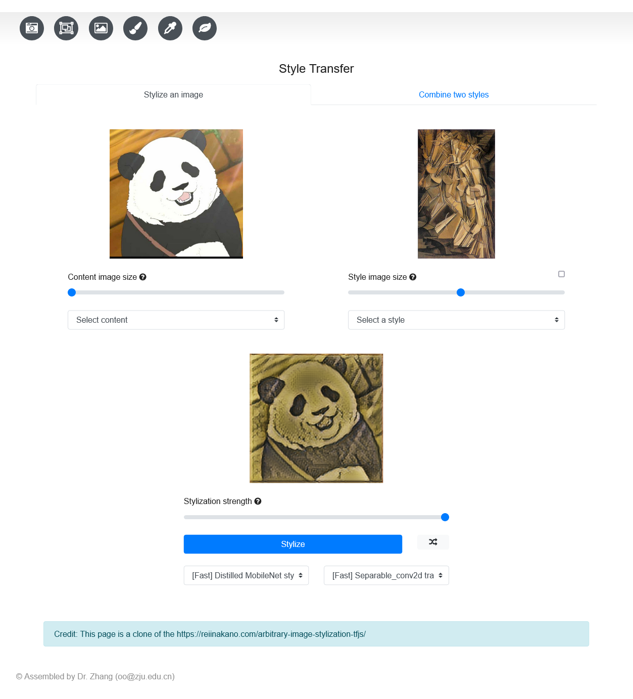
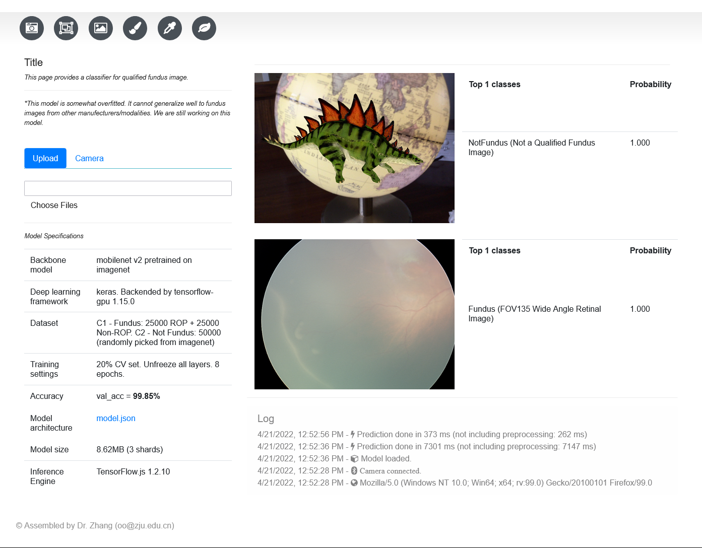
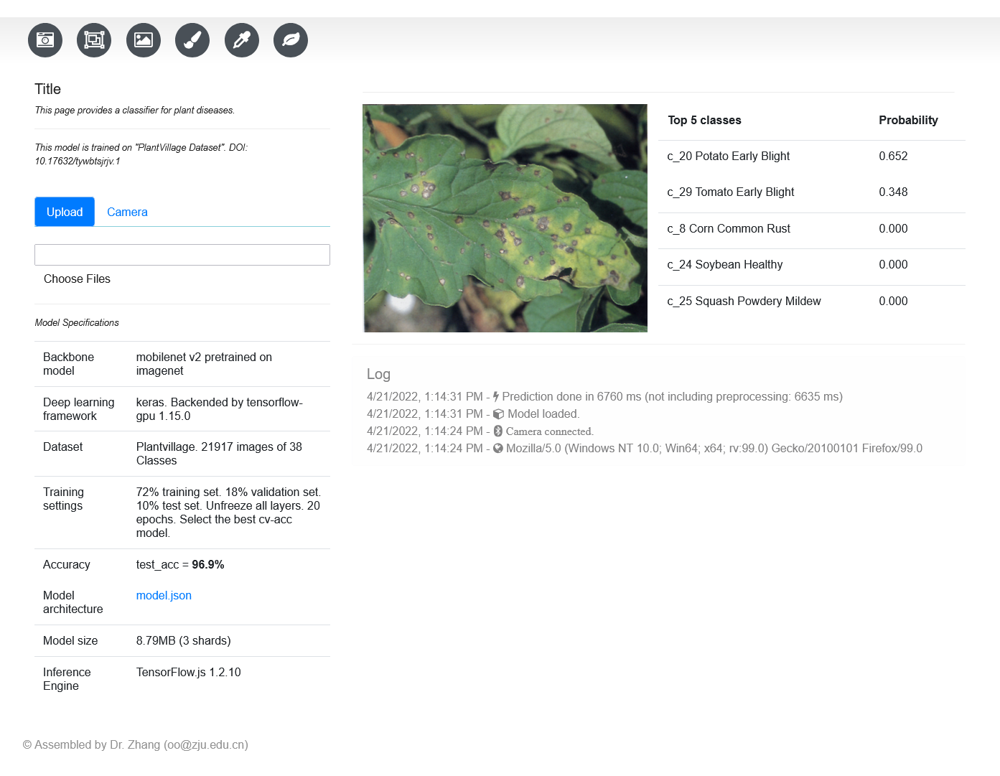

# About

This repo can be a good starting point for building your own tfjs (tensorflow-js)-based web applicaitons.  
The original project is developed for ASP.Net MVC (http://zhangys.org.cn/DeepLearning). Now I rewrite it as a Flask web app.

We provide 5 apps: 

1. General image classification based on a pre-trained mobilenet model on imagenet.

2. Object detection trained on COCO

3. Style transfer. Provided by Reiichiro Nakano (https://github.com/reiinakano/arbitrary-image-stylization-tfjs)

4. A binary classifier for judging fundus image quality.

5. A plant disease classifier trained on PlantVillage dataset (doi: 10.17632/tywbtsjrjv)

# Install

  > pip install tfjsa

# Run and open in web browser

  > python -m tfjsa.run  
  or  
  > python -m tfjsa.run silent

  > Go to http://localhost:5007

  When 'silent' is passed, tfjsa will not open browser automatically

# Run as a desktop application

  > python -m tfjsa.gui

# Guide on re-development or extended development

If you want to re-develop on this repo or deploy to other framework. You might want to revise the following points. 

1. This repo use Jinja2 template language to write "layout.html". You may need to change to other server-side template languages, e.g., php, C# Razor, etc.
   
2. To follow Flask practice, we have moved all static stuff (images, models, scripts, etc.) to the static folder. You may want to relocate these stuff if you deploy to other frameworks. As follows.

  For the Image Classification app, you may need to revise static stuff path

    `const MOBILENET_MODEL_PATH = 'static/Mobilenet/shards/model.json';`

    ``

  For the Object Detection app, 

    ``
    `img.src = "static/Mobilenet/cat.jpg";`
    coco-ssd.js: "static/SSD/shards/model.json"

   For Style Transfer app,

      Modify the bundle.js. Change "saved_model_xxx" to "static/styletransfer/saved_model_xxx"
      `element.src = 'static/styletransfer/images/' + selectedValue + '.jpg';`

  For Fundus Image Qualifier app,

    `const MOBILENET_MODEL_PATH =
        '/Assets/DNNs/Mobilenet_F2/model.json';`
    `<td><a target="_blank" href="static/Mobilenet_F2/model.json">model.json</a></td>`
    `src="static/Mobilenet_F2/fundus.png"`

  For Leaf app, 

    `<td><a target="_blank" href="static/Mobilenet_leaf/model.json">model.json</a></td>`

    `src="static/Mobilenet_Leaf/tomato_leaf.jpg"`

# Run directly from source

1. git clone https://github.com/zhangys11/tfjs-app.git
2. cd tfjs-app/tfjsa
3. python run.py
4. Go to http://localhost:5007/